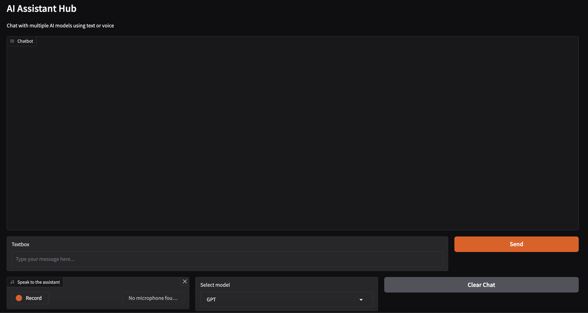

# Multi-Model-AI-Assistant

Welcome to the **Multi-Model-AI-Assistant** — a powerful, voice-enabled, multi-model chat interface that lets you interact with **OpenAI GPT**, **Ollama LLaMA 3.2**, and **Google Gemini 1.5 Flash**. This Gradio-based web app supports both text and speech input, and can even talk back to you using real-time audio playback.



## Table of Contents

- [Features](#features)
- [Tech Stack](#tech-stack)
- [Architecture](#architecture)
- [Installation](#installation)
- [LLaMA 3.2 Setup via Ollama](#llama-32-setup-via-ollama)
- [API Key Setup](#api-key-setup)

## Features

- **Multi-Model Chat**
  - Seamlessly switch between GPT (OpenAI), LLaMA 3.2 (Ollama), and Gemini (Google).
  
- **Voice Interaction**
  - Speak to the assistant via your microphone.
  - Hear responses read aloud with natural-sounding text-to-speech.

- **Real-Time Streaming**
  - Supports streaming responses from all models for faster feedback.

- **Gradio Web Interface**
  - Clean, intuitive UI for chatting and model selection.
  - Works in the browser — no frontend coding required.

## Tech Stack

- **Frontend/UI:** Gradio
- **AI Models:**
  - OpenAI GPT-4o-mini (`tts-1`, `whisper-1`)
  - Ollama LLaMA 3.2 (runs locally)
  - Google Gemini 1.5 Flash
- **Audio Processing:** pydub, ffmpeg
- **Language:** Python 3.10+

## Architecture

The app is designed for modularity and flexibility:

- **UI Layer:** Built with Gradio, allows seamless switching between models and input modes.
- **Audio Handler:**
  - Uses OpenAI’s Whisper to transcribe spoken input.
  - Converts AI responses to audio using OpenAI’s TTS.
- **Model Router:** Routes input to the selected backend (GPT, LLaMA, or Gemini).
- **Local LLM Support:** Runs LLaMA 3.2 locally via Ollama for private, offline inference.

## LLaMA 3.2 Setup via Ollama

This app uses **LLaMA 3.2**, running locally through [Ollama](https://ollama.com), allowing fast, private, and offline AI generation — no API keys required.

### Steps to Install LLaMA Locally

1. **Install Ollama**  
   Download Ollama from [https://ollama.com](https://ollama.com) for your OS.

2. **Start the Ollama Server**
   ```bash
   ollama serve
   ```
   
3. **Download the LLaMA 3.2 model**
   ```bash
   ollama pull llama3.2
   ```

4. **Confirm Ollama is running at:**
   [Ollama](http://localhost:11434)
   
## API Key Setup

This app uses OpenAI and Google APIs for GPT and Gemini support

1. **OpenAI API Key**
   Get your key from [OpenAI](https://platform.openai.com/account/api-keys)
   
2. **Google API Key (Gemini)**
   Get your key from [Gemini](https://makersuite.google.com/app/apikey)
   
3. **Add a .env file in the root directory:**
    ```env
   OPENAI_API_KEY=your-openai-key-here
   GOOGLE_API_KEY=your-google-api-key-here
   ```
    
## Installation

1. **Clone the repository:**
    ```bash
   git clone https://github.com/yourusername/ai-assistant-hub.git
   cd ai-assistant-hub
   ```
    
2. **Create the Conda environment**
   Make sure you have [Anaconda](https://www.anaconda.com/) or [Miniconda](https://www.anaconda.com/docs/getting-started/miniconda/main) installed.
    ```bash
   conda env create -f environment.yml
   ```
    
3. **Activate the environment**
    ```bash
   conda activate ai-assistant
   ```
    
4. **Run the app**
   ```bash
   python assistant.py
   ```
